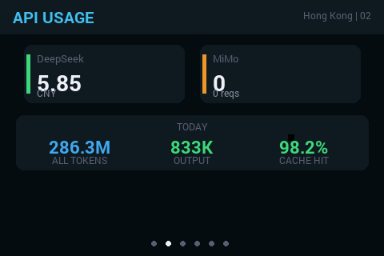
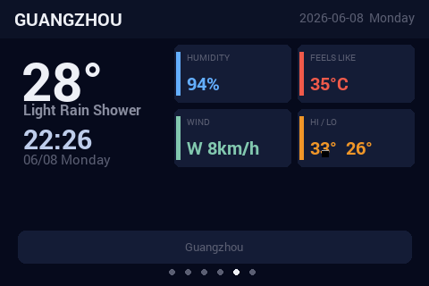
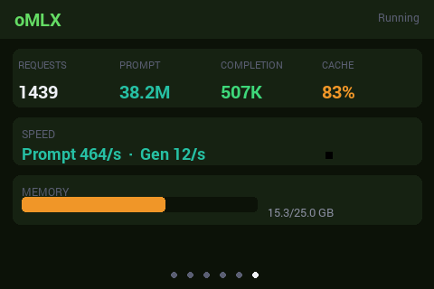
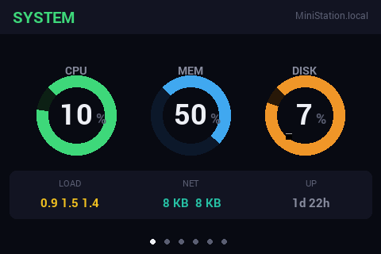
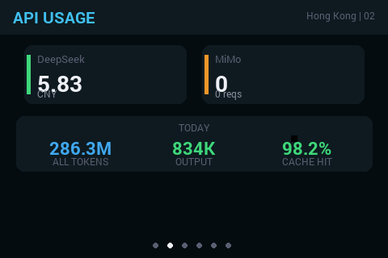

# RpiZeroMon

> 树莓派 Zero W + 3.5 寸 GPIO 屏幕 = 一台精美的 Mac 状态副屏

通过 USB/网络将 Mac 的系统状态、API 用量、代理信息等实时推送到树莓派 Zero W 的 3.5 寸 SPI 屏幕上，6 个页面每 15 秒自动轮播。

## 页面展示

| 系统状态 | API 用量 |
|----------|----------|
|  |  |

| Clash 代理 | Codex 用量 |
|------------|------------|
|  |  |

| 天气 | oMLX 本地模型 |
|------|---------------|
|  |  |

## 架构

```
┌─────────────┐    TCP:9877     ┌──────────────────┐
│  Mac 发送端  │ ──────────────→ │  树莓派 Zero W    │
│  sidemon.py  │   每秒推送 JSON  │  sidemon-pil.py   │
│              │                 │  PIL 渲染到 /dev/fb0 │
└─────────────┘                 └──────────────────┘
                                      │
                                      ↓
                                3.5" SPI 屏幕
                                (480×320, 旋转 180°)
```

- **Mac 端**（`mac/sidemon.py`）：采集系统状态、API 余额、Clash 代理、Codex 用量、天气、oMLX 等信息，打包为 JSON 通过 TCP 推送到 Pi
- **Pi 端**（`pirecv/sidemon-pil.py`）：接收 JSON 数据，用 Pillow 渲染 6 个页面到 framebuffer，15 秒轮播
- **自动发现**：Pi 端通过 UDP 广播（端口 9878），Mac 端自动扫描局域网找到 Pi

## 6 个页面

| 页面 | 内容 | 数据来源 |
|------|------|----------|
| **SYSTEM** | CPU / 内存 / 磁盘 环形图，负载，网络，运行时间 | `psutil` |
| **API USAGE** | DeepSeek 余额 + MiMo 当日 Token 用量，缓存命中率 | DeepSeek API + CC Switch 数据库 |
| **CLASH** | 当前节点，已用/总流量，上传/下载，到期时间 | Mihomo Unix Socket API |
| **CODEX** | 5 小时 / 7 天 Token 用量，重置时间 | Codex SQLite 数据库 |
| **WEATHER** | 温度、体感、湿度、风速、最高/最低温 | wttr.in API |
| **oMLX** | 请求数、Prompt/Completion Token、缓存效率、内存 | oMLX HTTP API + stats.json |

## 快速开始

### 硬件要求

- 树莓派 Zero W（或任何树莓派）
- 3.5 寸 GPIO SPI 屏幕（ILI9486 驱动）
- Raspberry Pi OS Lite（无桌面环境）

### 1. Pi 端安装

屏幕驱动使用 [lcddiy/LCD-show](https://github.com/lcddiy/LCD-show)：

```bash
git clone https://github.com/lcddiy/LCD-show.git
cd LCD-show
sudo ./LCD35-show
```

安装依赖并部署 sidemon-pil：

```bash
sudo apt-get install -y python3-pip
pip3 install pillow

# 将 pirecv/sidemon-pil.py 复制到 /home/pi/
# 创建 systemd 服务实现开机自启：
sudo tee /etc/systemd/system/sidemon-pil.service << 'SVC'
[Unit]
Description=SideMon PIL SPI dashboard
After=network.target

[Service]
ExecStart=/usr/bin/python3 /home/pi/sidemon-pil.py --fb /dev/fb0 --cycle 15
Restart=always
User=pi
WorkingDirectory=/home/pi

[Install]
WantedBy=multi-user.target
SVC

sudo systemctl daemon-reload
sudo systemctl enable --now sidemon-pil
```

### 2. Mac 端运行

```bash
# 安装依赖
pip3 install psutil requests

# 运行发送端（自动发现 Pi 或手动指定 IP）
python3 mac/sidemon.py --host 192.168.1.37 -i 1
```

### 3. 桌面 App

```bash
# 编译为 .app
pip3 install py2app
python3 setup.py py2app
# 输出在 dist/RpiZeroMon.app，可拖到桌面双击运行
```

## 命令行参数

| 参数 | 说明 | 默认值 |
|------|------|--------|
| `--host`, `-H` | Pi 的 IP 地址（自动发现失败时使用） | `192.168.1.24` |
| `--port`, `-P` | TCP 端口 | `9877` |
| `--interval`, `-i` | 数据推送间隔（秒） | `1.0` |
| `--once`, `-1` | 单次采集并打印 JSON，不循环 | — |
| `--ds-key` | DeepSeek API Key（也可设 `DEEPSEEK_KEY` 环境变量） | — |
| `--mm-key` | MiMo API Key（也可设 `MINIMI_KEY` 环境变量） | — |

## 一键部署脚本

```bash
cd /Volumes/MACdata/Docs/Documents/SideMon && bash deploy_pi.sh
```

自动完成：连接测试 → 停服务 → 上传代码 → 启服务 → 显示日志。
