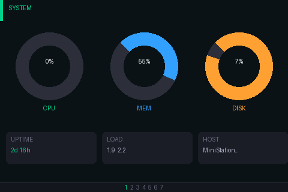
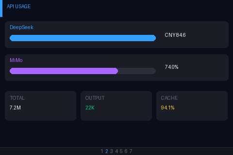
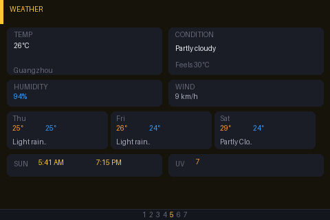
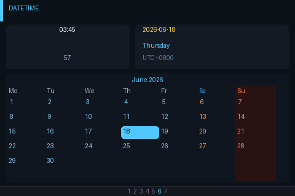
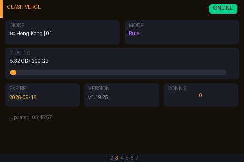
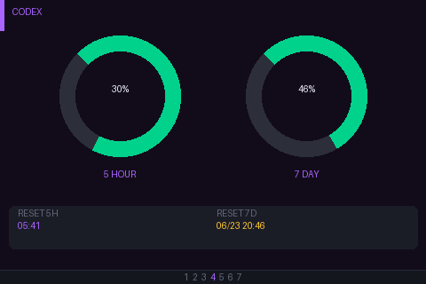

# RpiZeroMon

> Mac 副屏监控仪表盘：支持树莓派 Zero W（480×320）与 ESP32 CYD（320×240）两种显示端

Mac 端实时采集系统状态、API 用量、Clash 代理、Codex 额度、天气、日期时间等信息，通过 TCP JSON 推送到显示端；树莓派端使用 Pillow 高质量渲染，ESP32 CYD 端使用 TFT_eSPI 直驱屏幕。两种显示端都支持 15 秒自动轮播，并通过 UDP 9878 广播被 Mac 端自动发现。

## 📸 页面展示

| 系统状态 | API 用量 |
|----------|----------|
|  |  |

| 天气 | 日期时间 |
|------|----------|
|  |  |

| Clash 代理 | Codex 额度 |
|------------|------------|
|  |  |

## 🏗 架构

```
┌──────────────────┐     TCP :9877      ┌─────────────────────┐
│   Mac 发送端       │ ─────────────────→ │  树莓派 Zero W       │
│   RpiZeroMon.app  │   每秒推送 JSON     │  sidemon-pil.py      │
│                    │                    │  渲染到 /dev/fb0      │
│  采集源:           │                    │  480×320 旋转 180°   │
│  · psutil          │                    └─────────────────────┘
│  · codex app-server│
│  · Clash socket    │
│  · DeepSeek API    │
│  · MiMo API        │
│  · wttr.in 天气    │
│  · oMLX 本地模型   │
└──────────────────┘
```
### ESP32 CYD（备选显示端）

```
┌──────────────────┐     TCP :9877      ┌─────────────────────┐
│   Mac 发送端       │ ─────────────────→ │  ESP32 CYD           │
│   RpiZeroMon.app  │   每秒推送 JSON     │  cyd/src/main.cpp    │
│                    │                    │  TFT_eSPI 320×240    │
│  UDP 9878 自动发现  │                    │  15 秒轮播           │
└──────────────────┘                    └─────────────────────┘
```

- 固件目录：`cyd/`
- 构建工具：PlatformIO
- 屏幕：320×240，ILI9341，TFT_eSPI 直驱
- 协议：复用 Mac sender 的 TCP JSON payload，支持 `_control.pages`
- 自动发现：固件启动后通过 UDP 9878 广播 `{"type":"sidemon","port":9877}`

## 📦 页面说明

| 页面 | 标签 | 数据来源 | 说明 |
|------|------|----------|------|
| System | `system` | psutil | CPU / 内存 / 磁盘百分比圆环，Uptime / Load / Hostname |
| API | `ccswitch` | DeepSeek API, MiMo API, CC Switch DB | 两组 API 余额/用量，当日 Token 统计 |
| Weather | `weather` | wttr.in | 气温、体感温度、湿度、风向、3 日预报 |
| DateTime | `datetime` | 本地时间 | 当前日期时间及月历 |
| Clash | `clash` | Mihomo Socket | 代理节点、流量、到期日、模式、连接数 |
| Codex | `codex` | Codex App-Server WebSocket | 5h/7d 用量百分比（实时官方数据）、重置时间 |

## 🚀 快速开始
### ESP32 CYD（固件构建/烧录）

```bash
cd cyd
# 先在 platformio.ini 的 build_flags 中配置 SIDEMON_DEFAULT_SSID / SIDEMON_DEFAULT_PASS
pio run -e cyd
# 烧录
pio run -e cyd -t upload
```

首次启动后：
1. 固件会先显示 `Waiting for data` 和本机 IP。
2. Mac sender 通过 UDP 9878 发现 CYD，然后建立 TCP 连接并推送 payload。
3. 页面会按 `_control.pages` 轮播；如未收到控制字段，则使用默认 7 页顺序。

> CYD 固件已内置 WiFiManager 自动配网：首次上电或未配置 WiFi 时会启动 `SideMon-CYD` 热点（密码 `sidemon1234`），在手机或电脑浏览器打开 `192.168.4.1` 配网即可；配网成功后凭据会自动保存，后续重启直接重连，不需要重新编译固件。


### 树莓派 Zero W（显示端）

```bash
# 1. 安装依赖
sudo apt install python3-pil

# 2. 上传代码并运行
scp pirecv/sidemon-pil.py pi@192.168.1.x:/home/pi/sidemon/
ssh pi@192.168.1.x
sudo python3 /home/pi/sidemon/sidemon-pil.py --fb /dev/fb0 --cycle 15 &
```

### Mac（发送端）

**方式一：双击运行（推荐）**

下载 [Release](https://github.com/joshua76y/SideMon/releases) 中的 `RpiZeroMon.app`，放到桌面双击即可。首次启动会自动发现局域网内的显示端并弹出设置窗口。

**方式二：命令行**

```bash
pip3 install psutil requests
python3 mac/sidemon.py --host 192.168.1.x -i 1
```

### 构建 macOS App

```bash
pip3 install py2app
python3 setup.py py2app
cp -R dist/RpiZeroMon.app ~/Desktop/
```

## ⚙️ 配置

设置文件位于 `~/Library/Application Support/RpiZeroMon/config.json`：

```json
{
  "host": "192.168.1.37",
  "port": 9877,
  "interval": 1.0,
  "pages": ["system", "ccswitch", "weather", "datetime", "clash", "codex"],
  "deepseek_key": "sk-...",
  "mimo_key": "sk-...",
  "mimo_base": "https://api.xiaomimimo.com",
  "weather_city": "Guangzhou"
}
```

- `pages`：勾选启用及排序，Pi 端只轮播这些页面
- API Key 可通过 macOS App 设置窗口配置，或写入 JSON 文件
- 显示端 IP 支持 UDP 自动发现，无需手动填写

## 🔧 开发

```bash
# 语法检查
python3 -m py_compile mac/sidemon.py pirecv/sidemon-pil.py

# Mac 端单次测试（打印 JSON 不发送）
python3 mac/sidemon.py --once --host 192.168.1.x

# 部署到 Pi
bash deploy_pi.sh
```

## 📝 技术细节

- **Codex 数据获取**：通过 `codex app-server` 的 WebSocket 接口（JSON-RPC `account/rateLimits/read`），直接拿到官方的 5 小时/7 天滑动窗口用量百分比和重置时间，数据与 Codex App 完全一致
- **Clash 节点检测**：当 GLOBAL 组为 DIRECT 时自动回退到 Proxies 组显示实际代理节点
- **屏幕渲染**：Pillow + 抗锯齿字体，每页面独立配色，圆环进度条根据百分比自动变色（绿→黄→橙→红）
- **UDP 自动发现**：Pi 端每 5 秒广播 `{"type":"sidemon","port":9877}`，Mac 端监听后自动填入 IP

## 📄 许可

MIT License
