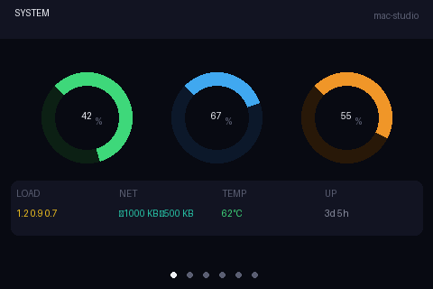
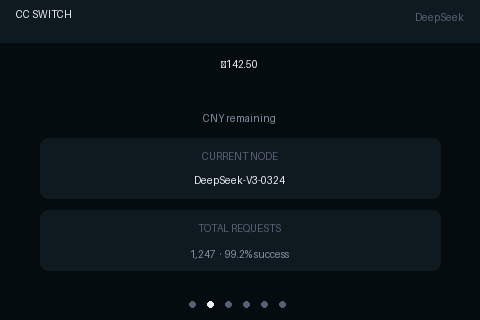
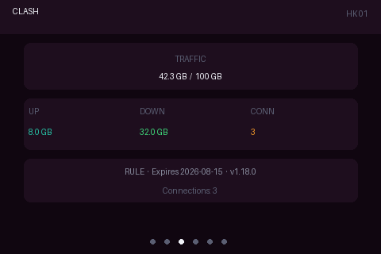
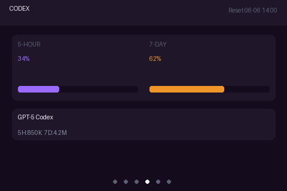
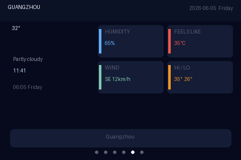
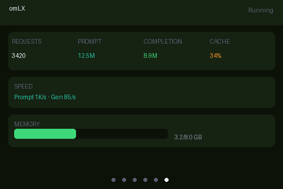

# SideMon

Mac 系统状态副屏监控 —— 在树莓派 Zero W 配 3.5 寸 TFT 屏幕上实时显示主机信息。

## 效果预览

480×320 分辨率，深色主题，6 个页面各有独特的背景色调，每 15 秒循环切换。

### System — 系统资源



CPU / 内存 / 磁盘环形进度图，Load Average、网络速率、温度、运行时长。

### CC Switch — DeepSeek 余额



当前余额、货币单位、连接节点、总请求数与成功率。

### Clash — 代理状态



流量使用量 / 上限、上传 / 下载总量、当前连接数、代理模式、到期日、版本号。

### Codex — Token 用量



5 小时 / 7 天 Token 用量百分比（带进度条）、使用的模型、绝对用量、重置时间。

### Weather — 天气与时间



当前温度、天气描述、实时时钟、完整年月日及星期、湿度、体感温度、风力、最高/最低温。

### omLX — 本地模型推理



总请求数、Prompt / Completion Token、缓存命中率、推理速度、显存使用量。

## 架构

```
┌──────────┐   TCP/JSON    ┌──────────────┐    fbcp      ┌───────────┐
│   Mac    │ ────────────→ │  Pi Zero W   │ ──────────→ │ 3.5" TFT  │
│ (发送端)  │   每秒发送     │ (接收 + 渲染)  │  DMA / SPI  │ ILI9486   │
└──────────┘               └──────────────┘             │ 480×320   │
                                                        └───────────┘
```

- **Mac 端** (`mac/sidemon.py`)：采集 CPU、内存、磁盘、网络、温度等系统信息，以及 CC Switch 余额、Clash 代理状态、Codex Token 用量、omLX 推理统计、天气数据，通过 TCP 发送 JSON 到树莓派。
- **树莓派 Zero W** (`pirecv/sidemon-pil.py`)：接收 JSON 数据，用 Pillow 渲染 6 个页面并输出到 `/dev/fb0` 帧缓冲。
- **fbcp-ili9341**：高效的帧缓冲到 SPI 屏幕 DMA 驱动，将 `/dev/fb0` 内容推送到 ILI9486 屏幕，支持自适应差分更新，在 Pi Zero W 上达到流畅刷新。

## 设计细节

- **每页独立配色**：System 深灰、CC Switch 深青、Clash 深紫、Codex 紫蓝、Weather 深蓝、omLX 深绿，切换时一眼可辨
- **环形进度图**：CPU（绿）、内存（蓝）、磁盘（橙）三环并排，百分比数字精确居中
- **彩色信息卡片**：天气页用带色条的卡片区分湿度、体感温度、风力、高低温度
- **Piboto 字体**：使用 Raspberry Pi OS 自带英文字体，渲染效果清晰锐利
- **15 秒自动循环**：底部圆点指示器显示当前页面位置

## 硬件

| 组件 | 型号 |
|------|------|
| 主控 | Raspberry Pi Zero W |
| 屏幕 | WaveShare 3.5" TFT (ILI9486, 480×320, SPI) |
| 系统 | Raspberry Pi OS (Bookworm) Lite |
| 连线 | GPIO: DC=BCM24, RST=BCM25, BL=BCM18, SPI0 |

### /boot/config.txt

```
dtparam=spi=on
hdmi_group=2
hdmi_mode=87
hdmi_cvt=480 320 60
hdmi_force_hotplug=1
```

### /boot/cmdline.txt 追加

```
bcm2708_fb.fbwidth=480 bcm2708_fb.fbheight=320 bcm2708_fb.fbswap=1
```

## 安装

### 树莓派

```bash
# 安装依赖
sudo apt install -y python3-pil git cmake

# 编译 fbcp-ili9341（帧缓冲到 SPI 屏幕的 DMA 驱动）
git clone https://github.com/juj/fbcp-ili9341.git
cd fbcp-ili9341 && mkdir build && cd build
cmake -DWAVESHARE35B_ILI9486=ON -DCMAKE_BUILD_TYPE=Release ..
make -j$(nproc)
sudo install fbcp-ili9341 /usr/local/bin/

# 复制接收端脚本
scp pirecv/sidemon-pil.py pi@192.168.1.24:/home/pi/

# 安装 systemd 服务
sudo cp pirecv/fbcp-ili9341.service /etc/systemd/system/
sudo cp pirecv/sidemon-pil.service /etc/systemd/system/
sudo systemctl daemon-reload
sudo systemctl enable fbcp-ili9341 sidemon-pil
sudo systemctl start fbcp-ili9341 sidemon-pil
```

### Mac

```bash
pip3 install psutil requests

cd mac
python3 sidemon.py --host 192.168.1.24 --port 9877 -i 1

# 或使用 launchd 开机自启
cp com.sidemon.sender.plist ~/Library/LaunchAgents/
launchctl load ~/Library/LaunchAgents/com.sidemon.sender.plist
```

## 目录结构

```
SideMon/
├── README.md
├── screenshots/               # 各页面截图
├── mac/
│   ├── sidemon.py             # Mac 发送端
│   └── requirements.txt
├── pirecv/
│   ├── sidemon-pil.py         # Pi 接收端（Pillow 渲染 → /dev/fb0）
│   └── ili9486.py             # ILI9486 直驱模块（备用）
└── run_sender.sh              # 发送端保活脚本
```

## 故障排查

| 现象 | 解决方法 |
|------|----------|
| 白屏 | 检查 `fbcp-ili9341` 是否运行：`systemctl status fbcp-ili9341` |
| 一直显示 "Waiting for data..." | Mac 发送端未运行或 IP 不通 |
| 屏幕闪烁 | 调整 fbcp 编译参数或降低 SPI 频率 |
| 某些页面数据不全 | 检查 Mac 端对应软件是否运行，字段名是否匹配 |
| 页面内容重叠 | 更新到最新版 `sidemon-pil.py`，已修复布局问题 |
| 中文显示为方块 | 已移除中文字体。若需中文，请自行配置支持 CJK 的 ttf 字体 |
